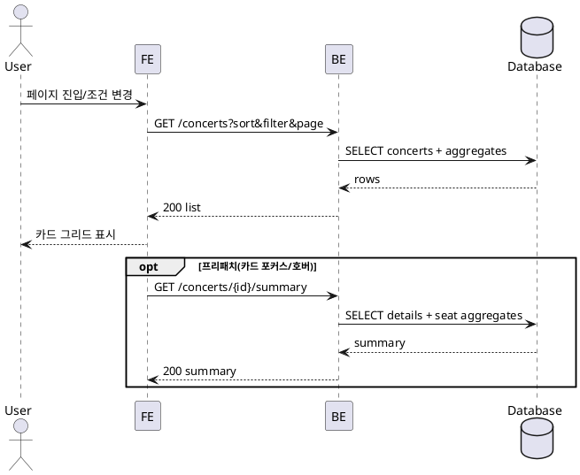

# 001 메인(홈) – 콘서트 목록 탐색 및 상세 진입

- Primary Actor: 비회원 사용자
- Precondition (사용자): 브라우저 접근 가능, 네트워크 연결 상태
- Trigger: 메인 페이지 접속 또는 정렬/필터/스크롤 조작
- Main Scenario:
  1) 사용자가 메인 페이지에 접속한다.
  2) FE가 정렬/필터/페이지 파라미터로 목록을 요청한다.
  3) BE가 공연 목록과 집계를 조회하고 응답한다.
  4) FE가 카드 그리드를 표시한다.
  5) 사용자가 정렬/필터/스크롤을 변경하면 FE는 이전 요청을 취소하고 최신 조건으로 재요청한다.
  6) 사용자가 카드를 선택하면 상세 페이지로 이동한다.
- Edge Cases:
  - 빈 결과: 빈 상태 표시, 조건 유지
  - 네트워크/서버 오류: 재시도 가능 상태로 전환, 캐시가 있으면 표시
  - 고지연/중복 요청: 이전 요청 취소, 최신 요청만 반영
- Business Rules:
  - 신청인원=예약 좌석 수 합, 수용인원=전체 좌석 수 합
  - 시간대/표준시간 정규화 후 표시
  - 정렬/필터/스크롤 상태 보존

