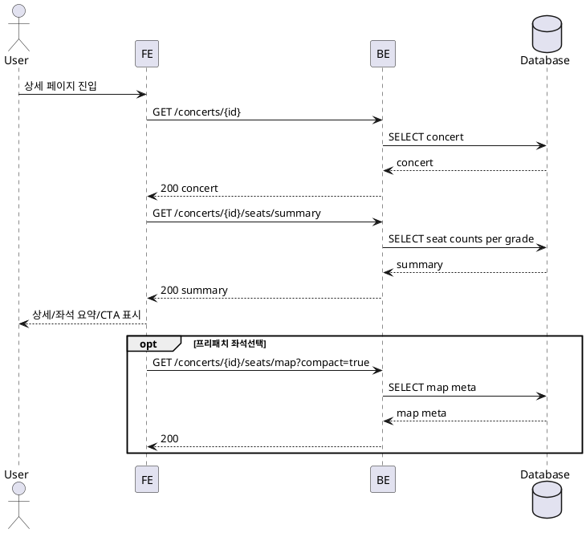

# 002 콘서트 상세 보기 및 좌석 현황 확인

- Primary Actor: 비회원 사용자
- Precondition (사용자): 목록에서 카드 선택 또는 유효한 상세 링크 접근
- Trigger: 콘서트 상세 페이지 진입
- Main Scenario:
  1) FE가 콘서트 기본 정보와 등급 요약을 요청한다.
  2) BE가 공연 정보, 등급별 가격/좌석 집계를 조회한다.
  3) FE가 상세 정보와 등급별 남은좌석/전체좌석을 표시한다.
  4) 판매 가능 시 CTA를 활성화하고 좌석선택 페이지를 프리패치한다.
- Edge Cases:
  - 식별자 없음/잘못됨: 접근 불가 상태 처리
  - 매진/종료/취소: CTA 비활성화, 상태 표시
  - 네트워크/오프라인: 캐시가 있으면 표시, 상호작용 제한
- Business Rules:
  - 등급: Special/Premium/Advanced/Regular
  - 남은좌석=총좌석-예약좌석, 비정상 값 보정
  - CTA 활성 조건은 판매 상태에 따름

