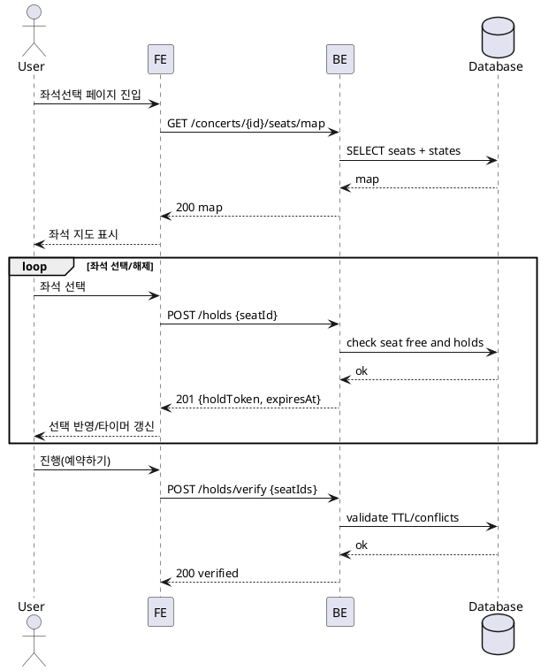

# 003 좌석 선택

- Primary Actor: 비회원 사용자
- Precondition (사용자): 상세 페이지에서 좌석선택으로 이동(직접 링크 허용)
- Trigger: 좌석 선택 페이지 진입 및 좌석 선택/해제/진행 클릭
- Main Scenario:
  1) FE가 좌석 지도/상태를 조회한다.
  2) 사용자가 좌석을 선택하면 FE가 홀드 생성 요청을 보낸다.
  3) BE가 예약/홀드 중복을 검사하고 유효하면 홀드를 생성한다.
  4) FE는 선택 요약과 홀드 만료 타이머를 갱신한다.
  5) 사용자가 좌석을 해제하면 FE가 홀드 해제 요청을 보낸다.
  6) 진행 클릭 시 FE는 최종 검증을 요청한다.
- Edge Cases:
  - 경합(409): 충돌 좌석만 해제, 최신 상태 재적용
  - 홀드 만료: 자동 해제 및 재선택 유도
  - 최대 선택 수 초과/규칙 위반: 안내 및 선택 제한
  - 오프라인/네트워크 오류: 낙관적 선택 원복, 재시도 제공
- Business Rules:
  - 혼합 등급 선택 허용
  - 최대 선택 좌석 수(설정값)
  - 홀드 TTL은 서버 시간 기준, 세션별 갱신 가능

