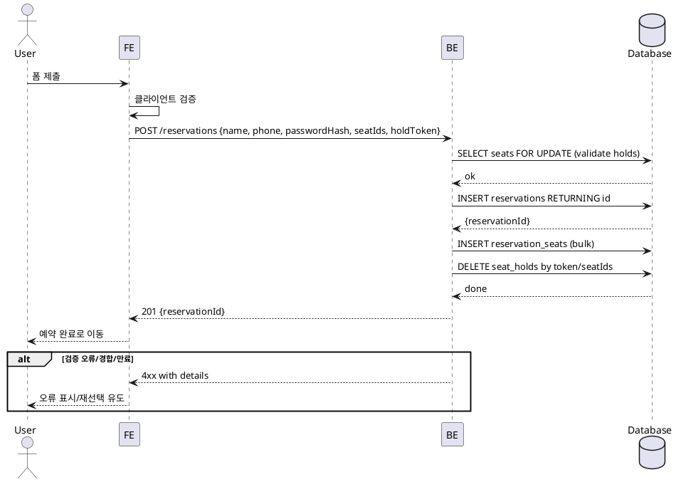

# 004 예약 정보 입력

- Primary Actor: 비회원 사용자
- Precondition (사용자): 좌석 선택 완료, 홀드 유효
- Trigger: 예약완료하기 제출
- Main Scenario:
  1) FE가 입력값을 클라이언트에서 검증한다.
  2) FE가 예약 생성 요청을 전송한다.
  3) BE가 트랜잭션으로 좌석을 잠그고 유효성을 재검증한다.
  4) BE가 예약을 생성하고 좌석 배정을 기록한다.
  5) BE가 관련 홀드를 삭제하고 예약 ID를 반환한다.
  6) FE는 완료 페이지로 전환한다.
- Edge Cases:
  - 입력 검증 오류(422): 필드별 오류 반환
  - 홀드 만료/경합: 해당 좌석만 제외 후 최신 상태 동봉
  - 중복 제출: 멱등 키로 단일 처리
  - 네트워크/서버 오류: 재시도 가능 상태
- Business Rules:
  - 전화번호는 숫자 10~11자리
  - 비밀번호는 해시로 저장(원문 미저장)
  - 좌석 이중 배정 금지(좌석당 단일 예약)

