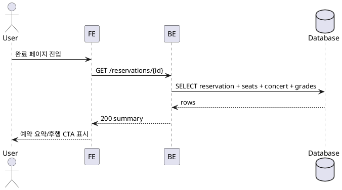

# 005 예약 완료 확인

- Primary Actor: 비회원 사용자
- Precondition (사용자): 예약 완료 직후 리다이렉트되었거나 유효한 링크를 알고 있음
- Trigger: 예약 완료 페이지 진입
- Main Scenario:
  1) FE가 예약 요약 데이터를 요청한다.
  2) BE가 예약/좌석/콘서트/등급 정보를 조인하여 응답한다.
  3) FE가 예약 번호, 공연 정보, 좌석 목록, 합계금액을 표시한다.
  4) 사용자가 후행 동작(조회/메인/공유)을 선택한다.
- Edge Cases:
  - 식별자 없음/만료/권한 없음: 접근 불가 처리
  - 데이터 불일치: 최신화 후 표시
  - 네트워크 오류: 재시도 가능 상태
- Business Rules:
  - 민감정보(전화번호/비밀번호)는 노출하지 않음
  - 핵심 정보 우선 렌더, 후행 페이지 프리패치

