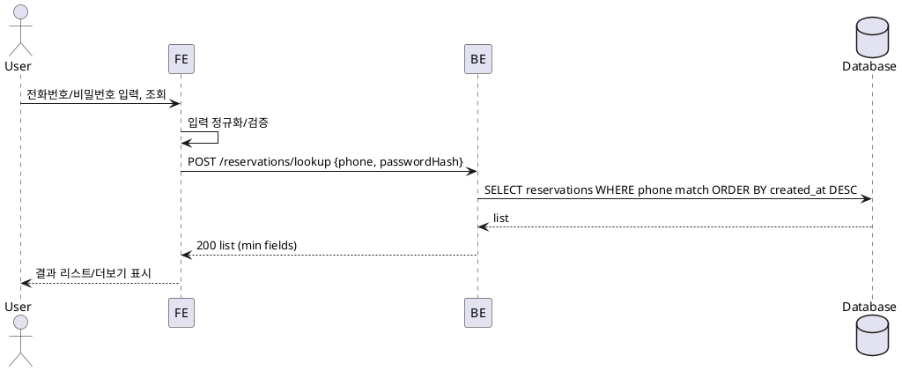

# 006 예약 조회(목록)

- Primary Actor: 비회원 사용자
- Precondition (사용자): 본인 전화번호와 비밀번호를 기억함
- Trigger: 예약 조회 페이지에서 조회 요청
- Main Scenario:
  1) 사용자가 전화번호/비밀번호를 입력하고 조회한다.
  2) FE가 정규화/클라이언트 검증 후 조회 요청을 전송한다.
  3) BE가 자격 증명을 검증하고 예약 목록을 최신순으로 반환한다.
  4) FE가 결과 리스트와 페이지네이션/더보기를 표시한다.
- Edge Cases:
  - 검증 실패/자격 불일치: 일반화된 오류 처리, 지연/쓰로틀
  - 결과 없음: 빈 상태 표시
  - 네트워크/서버 오류: 재시도 가능 상태
- Business Rules:
  - 존재 여부 노출 금지(자격 오류 메시지 일반화)
  - 조회 성공 시 단기 조회 토큰 발급 가능

