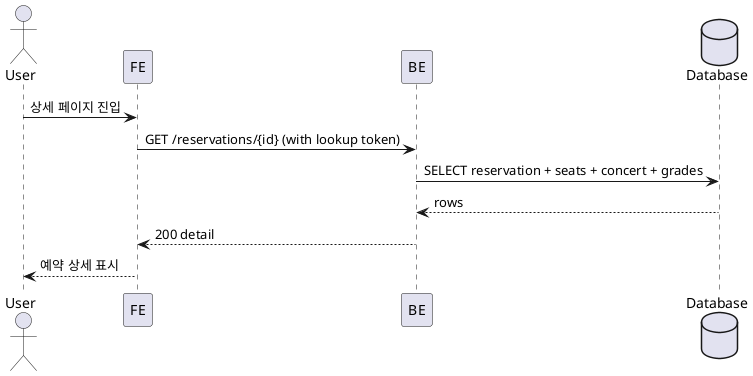

# 007 예약 상세 조회

- Primary Actor: 비회원 사용자
- Precondition (사용자): 조회 목록에서 항목을 선택했거나 유효한 상세 링크를 알고 있음
- Trigger: 예약 상세 페이지 진입
- Main Scenario:
  1) FE가 조회 토큰/자격을 포함하여 예약 상세를 요청한다.
  2) BE가 권한을 확인하고 예약/좌석/콘서트/등급 정보를 반환한다.
  3) FE가 예약 상세(좌석/금액/상태/생성시각)를 표시한다.
  4) 사용자가 후행 동작(목록 복귀/메인/저장)을 선택한다.
- Edge Cases:
  - 미존재/만료/권한 없음: 접근 불가 처리
  - 네트워크/서버 오류: 재시도 가능 상태
  - 오프라인: 캐시가 있으면 읽기 전용 표시
- Business Rules:
  - 민감정보 마스킹, 비밀번호/원문 식별자 미노출
  - 이상치 로깅 및 표시 최소화

