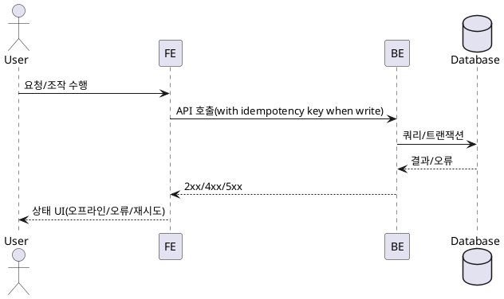

# 008 공통 예외 및 오프라인 처리

- Primary Actor: 비회원 사용자
- Precondition (사용자): 브라우저 사용 중, 간헐적 네트워크/지연 가능성 존재
- Trigger: 네트워크 장애/오류 응답/다중 탭 경쟁 등 발생
- Main Scenario:
  1) FE 글로벌 인터셉터가 요청 중복을 방지하고 오류를 표준 상태로 매핑한다.
  2) 읽기 요청은 지수 백오프로 재시도 가능, 쓰기 요청은 멱등 키를 부여한다.
  3) 오프라인 전환 시 읽기 전용 모드로 전환하고, 변경 작업을 차단한다.
  4) 온라인 복귀 시 전역 리밸리데이션으로 최신화한다.
- Edge Cases:
  - 409(경합): 최신 상태 재조회, 부분 롤백
  - 422(검증): 필드 매핑 후 안내
  - 429(과도한 시도): 점진적 지연/쓰로틀
  - 타임아웃/오프라인: 배너 표시, 재시도 인터랙션
- Business Rules:
  - 구체 사유 비노출 원칙, PII 로깅 금지
  - 좌석 홀드 TTL은 서버 시간을 기준으로 계산

