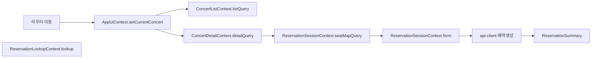

## 콘서트 예약 플로우: Context + useReducer 설계

### 목표
- 요구사항(`docs/requirement.md`) 기반 상태들을 Context + useReducer로 일관되게 관리
- 서버 상태는 `@tanstack/react-query`로, UI/세션 상태는 Reducer로 관리(Flux 흐름)
- 모든 HTTP 요청은 `@/lib/remote/api-client` 경유(규칙 준수)

### 컨텍스트 구성
- AppUiContext: 전역 진행 상태/에러, 현재 콘서트 식별자
- ConcertListContext: 목록 필터(정렬/검색 등) 및 목록 쿼리 제어
- ConcertDetailContext: 상세/등급별 재고 쿼리 제어
- ReservationSessionContext: 좌석 선택 + 예약자 정보 입력 + 예약 생성/완료로 이어지는 세션 상태
- ReservationLookupContext: 예약 조회 입력/결과 상태

각 컨텍스트는 라우트 경계(페이지) 기준으로 마운트/언마운트되어 리렌더 범위를 최소화합니다. 좌석 선택과 예약 입력은 하나의 세션 컨텍스트로 묶어 연속 플로우(좌석선택 → 정보입력 → 완료)를 보장합니다.

---

### 공통 타입 정의(요약)
```ts
// 식별자/기초 타입
export type ConcertId = string;
export type Zone = 'A' | 'B' | 'C' | 'D';
export type SeatServerStatus = 'available' | 'reserved';

// 목록 카드에 필요한 요약 정보
export interface ConcertSummary {
  id: ConcertId;
  title: string;
  date: string;           // ISO string
  location: string;
  appliedCount: number;
  capacity: number;
  imageUrl: string;       // picsum.photos 등 placeholder 허용
}

// 상세 페이지에 필요한 상세/등급 정보
export interface GradeInfo {
  id: string;
  name: string;
  price: number;          // KRW 정수
  color: string;          // Tailwind color token or HEX
  total: number;
  remaining: number;
}

export interface ConcertDetail extends ConcertSummary {
  description: string;
  grades: GradeInfo[];
}

// 좌석/좌석맵(서버 상태)
export interface SeatCell {
  seatId: string;
  zone: Zone;
  row: number;
  col: number;
  gradeId: string;
  status: SeatServerStatus; // available | reserved
}

// 선택 좌석(UI/세션 상태)
export interface SelectedSeat {
  seatId: string;
  zone: Zone;
  row: number;
  col: number;
  gradeId: string;
  price: number;
}

// 예약 요약(완료/조회 공용 표시 모델)
export interface ReservationSummary {
  reservationId: string;
  concertId: ConcertId;
  date: string;       // ISO string
  location: string;
  name: string;       // 예약자명
  maskedPhone: string; // 가운데 4자리 마스킹
  seats: SelectedSeat[];
  totalPrice: number;
  createdAt: string;  // ISO string
}
```

파생값(총 금액, 버튼 활성, 게이지 퍼센트, 색상)은 Context에 저장하지 않고 View에서 계산/표현합니다.

---

### AppUiContext
전역 진행/에러 및 현재 콘서트 식별자 관리

```ts
export interface AppUiState {
  currentConcertId: ConcertId | null;
  globalLoadingCount: number;      // 동시 요청 수(>0이면 전역 진행 인디케이터 on)
  globalErrorQueue: string[];      // 사용자 노출용 메시지 큐
}

export type AppUiAction =
  | { type: 'SET_CURRENT_CONCERT'; payload: { concertId: ConcertId | null } }
  | { type: 'REQUEST_STARTED' }
  | { type: 'REQUEST_FINISHED' }
  | { type: 'PUSH_ERROR'; payload: { message: string } }
  | { type: 'CLEAR_ERROR'; payload: { index?: number } };

export interface AppUiContextValue {
  state: AppUiState;
  // selectors(파생)
  isGlobalLoading: boolean;
  // actions
  setCurrentConcert(concertId: ConcertId | null): void;
  markRequestStarted(): void;
  markRequestFinished(): void;
  pushError(message: string): void;
  clearError(index?: number): void;
}
```

노출 변수/함수
- state.currentConcertId, isGlobalLoading, state.globalErrorQueue
- setCurrentConcert, markRequestStarted/Finished, pushError, clearError

Mermaid(데이터 흐름)
```mermaid
flowchart LR
  A[View Action] --> D[dispatch(AppUiAction)] --> R[(Reducer)] --> S[(AppUiState)] --> Sel[Selectors]
  Sel --> V[View]
```

---

### ConcertListContext
목록 필터 UI 상태와 목록 쿼리 제어(서버 상태는 React Query)

```ts
export interface ConcertListFilter {
  keyword: string;
  sortBy: 'date' | 'applied' | 'capacity';
  sortOrder: 'asc' | 'desc';
}

export interface ConcertListState {
  filter: ConcertListFilter;
}

export type ConcertListAction =
  | { type: 'SET_FILTER'; payload: Partial<ConcertListFilter> };

export interface ConcertListContextValue {
  state: ConcertListState;
  listQuery: unknown; // UseQueryResult<ConcertSummary[], Error>
  setFilter(patch: Partial<ConcertListFilter>): void;
  refetchList(): void;
}
```

노출 변수/함수
- state.filter, listQuery.data/listQuery.isLoading/listQuery.isError
- setFilter, refetchList

Mermaid(데이터 흐름)
```mermaid
flowchart LR
  User[사용자 입력: 필터] --> D[dispatch(SET_FILTER)] --> R[(Reducer)] --> S[(filter)] --> Q[React Query: 목록 fetch]
  Q --> V[콘서트 카드 리스트]
```

---

### ConcertDetailContext
상세/등급별 재고 쿼리 제어(서버 상태: React Query)

```ts
export interface ConcertDetailState {
  // UI 전용 상태가 필요할 때 확장(예: 강조 등급 id)
  highlightedGradeId: string | null;
}

export type ConcertDetailAction =
  | { type: 'HIGHLIGHT_GRADE'; payload: { gradeId: string | null } };

export interface ConcertDetailContextValue {
  state: ConcertDetailState;
  detailQuery: unknown;    // UseQueryResult<ConcertDetail, Error>
  refetchDetail(): void;
  highlightGrade(gradeId: string | null): void;
}
```

노출 변수/함수
- detailQuery.data(제목/설명/일시/장소/등급), state.highlightedGradeId
- refetchDetail, highlightGrade

Mermaid
```mermaid
flowchart LR
  Route[concertId] --> Q[React Query: 상세 fetch]
  User[등급 hover/선택] --> D[dispatch(HIGHLIGHT_GRADE)] --> R[(Reducer)] --> S[(highlightedGradeId)] --> V[View 강조]
  Q --> V
```

---

### ReservationSessionContext
좌석 선택 + 예약자 정보 입력 + 예약 생성/완료까지 세션 상태를 단일 컨텍스트로 관리

```ts
export interface ReservationFormState {
  name: string;
  phone: string; // 숫자만
  pin4: string;  // 길이 4, 숫자
  isValid: boolean;
}

export interface ReservationSubmitState {
  submitting: boolean;
  error: string | null;
  result: ReservationSummary | null;
}

export interface ReservationSessionState {
  // 좌석 선택
  selectedSeats: SelectedSeat[];   // 최대 4석
  selectionWarning: string | null; // 경고 메시지(선택 제한/예약 전이 등)
  // 폼
  form: ReservationFormState;
  // 제출
  submit: ReservationSubmitState;
}

export type ReservationSessionAction =
  | { type: 'TOGGLE_SEAT'; payload: { seat: SelectedSeat; maxSelectable: number } }
  | { type: 'CLEAR_SELECTION' }
  | { type: 'SET_SELECTION_WARNING'; payload: { message: string | null } }
  | { type: 'APPLY_RESERVED_TRANSITION'; payload: { reservedSeatIds: string[] } }
  | { type: 'SET_NAME'; payload: { name: string } }
  | { type: 'SET_PHONE'; payload: { phone: string } }
  | { type: 'SET_PIN4'; payload: { pin4: string } }
  | { type: 'REVALIDATE_FORM' }
  | { type: 'SUBMIT_START' }
  | { type: 'SUBMIT_SUCCESS'; payload: { summary: ReservationSummary } }
  | { type: 'SUBMIT_FAILURE'; payload: { error: string } };

export interface ReservationSessionContextValue {
  state: ReservationSessionState;
  // 서버 상태: 좌석맵 쿼리(React Query)
  seatMapQuery: unknown; // UseQueryResult<SeatCell[], Error>
  // 파생값
  selectedCount: number;
  totalPrice: number;
  canSubmit: boolean;
  // 액션
  toggleSeat(seat: SelectedSeat): void;
  clearSelection(): void;
  setSelectionWarning(message: string | null): void;
  applyReservedTransition(reservedSeatIds: string[]): void;
  setName(name: string): void;
  setPhone(phone: string): void;
  setPin4(pin4: string): void;
  submitReservation(): Promise<void>; // api-client 경유
  refetchSeatMap(): void;
}
```

노출 변수/함수
- state.selectedSeats, selectedCount, totalPrice, state.selectionWarning
- seatMapQuery.data/isLoading/isError, refetchSeatMap
- setName/setPhone/setPin4, state.form.isValid
- submitReservation, state.submit.submitting/state.submit.error/state.submit.result

Mermaid(좌석/폼/제출 흐름)
```mermaid
flowchart LR
  subgraph 좌석선택
    U1[좌석 클릭] --> D1[dispatch(TOGGLE_SEAT)] --> R1[(Reducer)] --> S1[(selectedSeats)]
    S1 --> V1[좌석 맵/선택 카드/n석]
    Q1[React Query seatMap] --> V1
    U1x[4석 초과 시도] --> D2[dispatch(SET_SELECTION_WARNING)] --> R1 --> S2[(selectionWarning)] --> V2[토스트]
    RT[실시간/리페치 예약 전이] --> D3[dispatch(APPLY_RESERVED_TRANSITION)] --> R1 --> S1
  end

  subgraph 폼/제출
    U2[입력 변경] --> D4[dispatch(SET_* / REVALIDATE_FORM)] --> R2[(Reducer)] --> S3[(form.isValid)]
    U3[예약 완료하기] --> D5[dispatch(SUBMIT_START)] --> R2 --> S4[(submit.submitting)]
    A[api-client 예약 생성] -->|성공| D6[dispatch(SUBMIT_SUCCESS)] --> R2 --> S5[(submit.result)]
    A -->|실패| D7[dispatch(SUBMIT_FAILURE)] --> R2 --> S6[(submit.error)]
    S3 --> V3[버튼 활성]
    S4 --> V3
    S5 --> V4[완료 페이지 이동]
    S6 --> V2
  end
```

---

### ReservationLookupContext
조회 입력/결과 상태 관리(서버 상태: React Query or mutate)

```ts
export interface ReservationLookupState {
  phone: string;
  pin4: string;
  loading: boolean;
  error: string | null;
  result: ReservationSummary | null;
}

export type ReservationLookupAction =
  | { type: 'SET_PHONE'; payload: { phone: string } }
  | { type: 'SET_PIN4'; payload: { pin4: string } }
  | { type: 'LOOKUP_START' }
  | { type: 'LOOKUP_SUCCESS'; payload: { summary: ReservationSummary } }
  | { type: 'LOOKUP_FAILURE'; payload: { error: string } };

export interface ReservationLookupContextValue {
  state: ReservationLookupState;
  setPhone(phone: string): void;
  setPin4(pin4: string): void;
  lookup(): Promise<void>; // api-client 경유
}
```

노출 변수/함수
- state.phone/state.pin4/state.loading/state.error/state.result
- setPhone/setPin4/lookup

Mermaid
```mermaid
flowchart LR
  U[입력 변경] --> D1[dispatch(SET_PHONE/PIN4)] --> R[(Reducer)] --> S[(phone,pin4)] --> V[폼]
  Go[조회 버튼] --> D2[dispatch(LOOKUP_START)] --> R --> S2[(loading)] --> A[api-client 조회]
  A -->|성공| D3[dispatch(LOOKUP_SUCCESS)] --> R --> S3[(result)] --> V2[표시]
  A -->|실패| D4[dispatch(LOOKUP_FAILURE)] --> R --> S4[(error)] --> V3[에러]
```

---

### 선택/파생 규칙
- 최대 선택 좌석 4석: Reducer에서 강제하며 초과 시 `selectionWarning` 설정
- 이미 예약된 좌석이 리페치/실시간으로 전이되면 `APPLY_RESERVED_TRANSITION`으로 선택 목록에서 제거
- 총 금액/버튼 활성/게이지 등은 View에서 계산(Selector/컴포넌트 내부 계산)

### 비동기 규칙
- 모든 HTTP는 `@/lib/remote/api-client`를 통해 호출
- 서버 상태는 React Query(`useQuery`, `useMutation`)로 관리, Context는 쿼리 결과와 UI 상태를 묶어 하위에 제공
- 전역 로딩/에러는 AppUiContext로 집계(요청 시작/종료에 따라 카운트/큐 관리)

### 하위 컴포넌트에 노출할 변수/함수(요약)
- AppUiContext: `currentConcertId`, `isGlobalLoading`, `globalErrorQueue`, `setCurrentConcert`, `markRequestStarted/Finished`, `pushError`, `clearError`
- ConcertListContext: `filter`, `listQuery`, `setFilter`, `refetchList`
- ConcertDetailContext: `detailQuery`, `highlightedGradeId`, `highlightGrade`, `refetchDetail`
- ReservationSessionContext: `selectedSeats`, `selectedCount`, `totalPrice`, `selectionWarning`, `seatMapQuery`, `toggleSeat`, `clearSelection`, `setSelectionWarning`, `applyReservedTransition`, `setName`, `setPhone`, `setPin4`, `canSubmit`, `submitReservation`, `refetchSeatMap`, `submit`(submitting/error/result)
- ReservationLookupContext: `phone`, `pin4`, `loading`, `error`, `result`, `setPhone`, `setPin4`, `lookup`

### 통합 시퀀스(요약) – 페이지 전환을 포함한 Flux


### 확장/테스트 포인트
- 실시간 좌석 전이는 서버 이벤트/폴링 중 하나를 선택하여 `APPLY_RESERVED_TRANSITION` 트리거
- Form 유효성은 `SET_*` 이후 `REVALIDATE_FORM`에서 중앙집중 처리(가독성 ↑)
- 컨텍스트 경계는 페이지 레벨이 기본이나, 성능 이슈 시 더 미세하게 분할 가능


